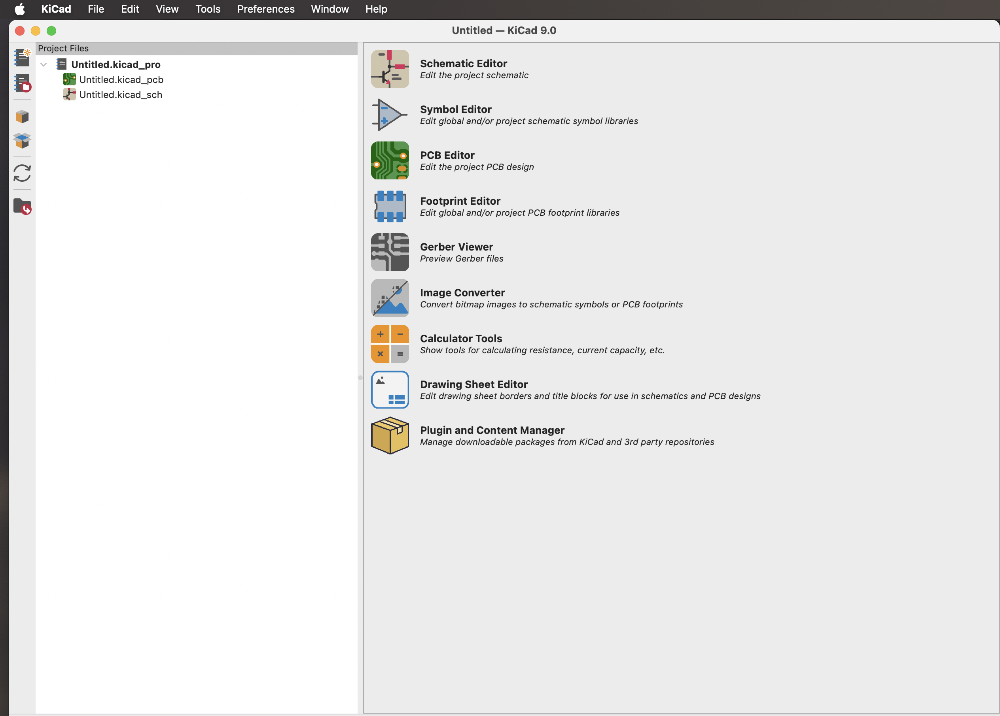
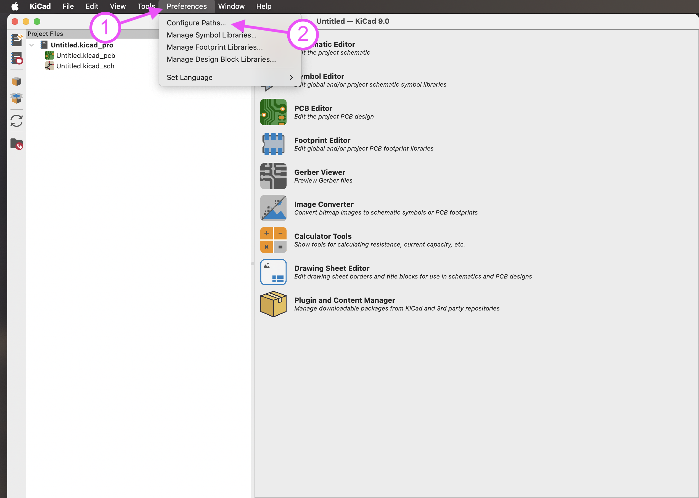
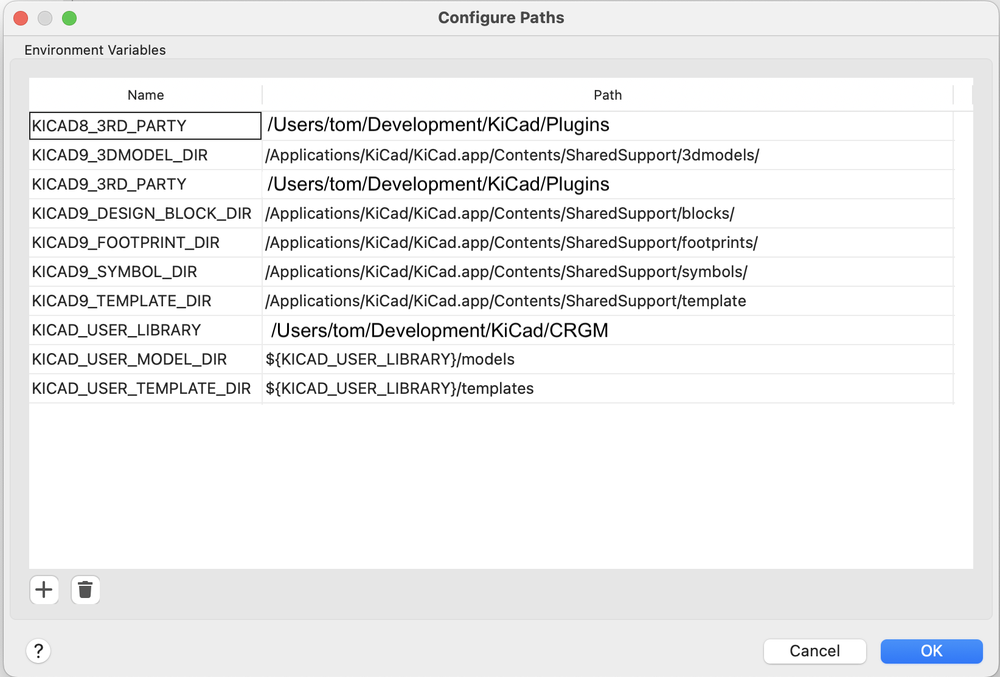
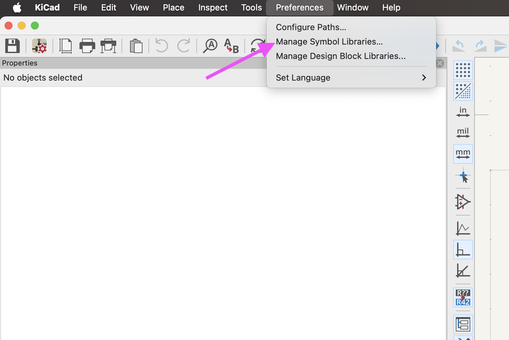
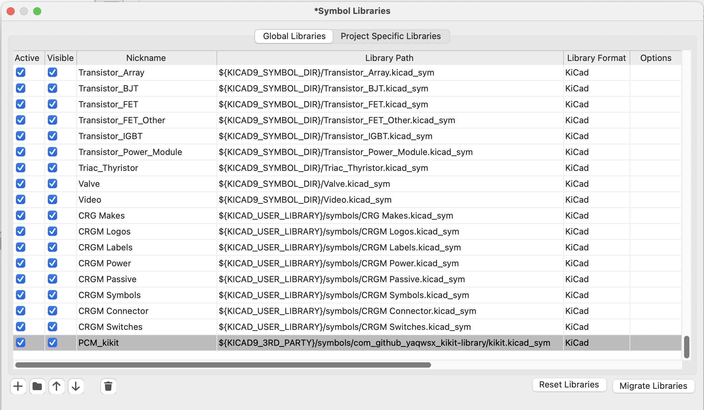
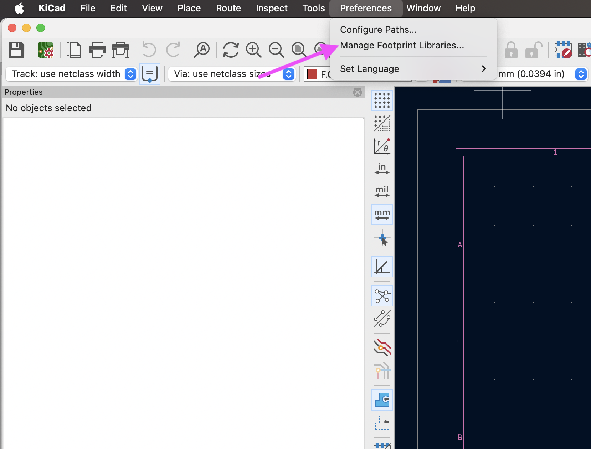
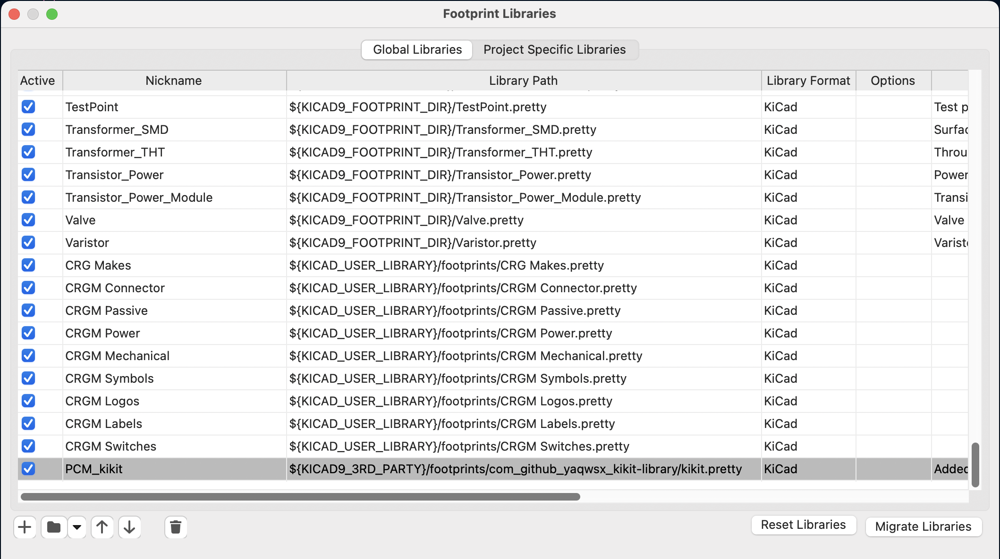
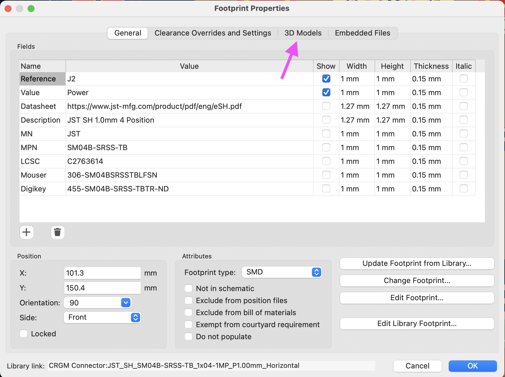
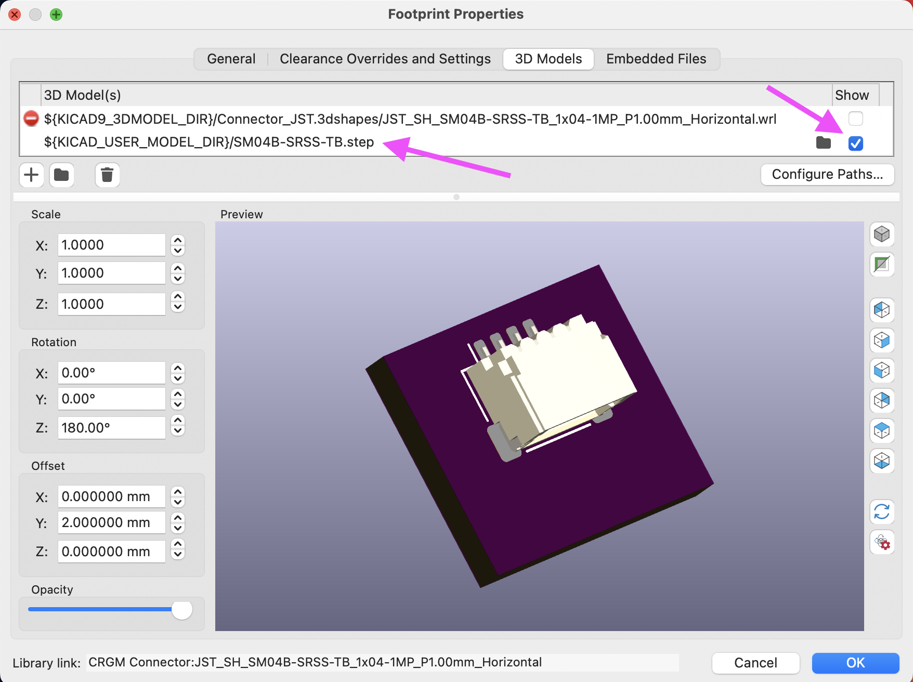

# CRG Makes KiCad Library

This repo contains all the KiCad symbols, footprints, models, and other files supporting [CRG Makes](https://crgmakes.com) development within KiCad.

## Installation

To install this library, start by [cloning](https://docs.github.com/en/repositories/creating-and-managing-repositories/cloning-a-repository) the [CRG Makes libary](https://github.com/crgmakes/kicad-library) repo to a convienent local directory.

In this example, our local directory will be: `/Users/tom/Development/KiCad/CRGM/`. 

  <i class="fas fa-exclamation-triangle"></i> <strong>Note:</strong> Replace this value with absolute path of where you place <b><i>your</i></b> library.

Start by setting the base parameters, the schematic parameters, and finally PCB parameters.

### Set Base Parameters

Within KiCad Project viewer:

Click on Preferences->Configure Paths...

Perform the following actions:

1. Click "+" near the bottom
1. Type "KICAD_USER_LIBRARY" in the first cell
1. Paste the local location repo's root directory (i.e., `/Users/tom/Development/KiCad/CRGM/`)
1. Click "+" near the bottom
1. In the first cell, type "KICAD_USER_MODEL_DIR"
1. In the second cell, paste "${KICAD_USER_LIBRARY}/models"
1. Click "+" near the bottom
1. In the first cell, type "KICAD_USER_TEMPLATE_DIR"
1. In the second cell, paste "${KICAD_USER_LIBRARY}/templates"

Your screen should look something like this:

Click OK to save.

### Schematic

Within KiCad Schematic Editor, click Preferences->Manage Symbol Libraries...

Add the following parameters by clicking +:

<table class="table table-bordered">
  <thead class="thead-light">
    <tr>
      <th>Name</th>
      <th>Value</th>
    </tr>
  </thead>
  <tbody>
    <tr>
      <td>CRG Makes</td>
      <td>${KICAD_USER_LIBRARY}/symbols/CRG Makes.kicad_sym</td>
    </tr>
    <tr>
      <td>CRGM Connector</td>
      <td>${KICAD_USER_LIBRARY}/symbols/CRGM Connector.kicad_sym</td>
    </tr>
    <tr>
      <td>CRGM Logos</td>
      <td>${KICAD_USER_LIBRARY}/symbols/CRG Makes.kicad_sym</td>
    </tr>
    <tr>
      <td>CRGM Labels</td>
      <td>${KICAD_USER_LIBRARY}/symbols/CRGM Labels.kicad_sym</td>
    </tr>
    <tr>
      <td>CRGM Power</td>
      <td>${KICAD_USER_LIBRARY}/symbols/CRGM Power.kicad_sym</td>
    </tr>
    <tr>
      <td>CRGM Passive</td>
      <td>${KICAD_USER_LIBRARY}/symbols/CRGM Passive.kicad_sym</td>
    </tr>
    <tr>
      <td>CRGM Symbols</td>
      <td>${KICAD_USER_LIBRARY}/symbols/CRGM Symbols.kicad_sym</td>
    </tr>
    <tr>
      <td>CRGM Switches</td>
      <td>${KICAD_USER_LIBRARY}/symbols/CRGM Switches.kicad_sym</td>
    </tr>
  </tbody>
</table>

Your parameters should look like this:

### PCB

Within KiCad PCB Editor, click Preferences->Manage Footprint Libraries...

Add the following parameters by clicking +:

<table class="table table-bordered">
  <thead class="thead-light">
    <tr>
      <th>Name</th>
      <th>Value</th>
    </tr>
  </thead>
  <tbody>
    <tr>
      <td>CRG Makes</td>
      <td>${KICAD_USER_LIBRARY}/footprints/CRG Makes.pretty</td>
    </tr>
    <tr>
      <td>CRGM Connector</td>
      <td>${KICAD_USER_LIBRARY}/footprints/CRGM Connector.pretty</td>
    </tr>
    <tr>
      <td>CRGM Logos</td>
      <td>${KICAD_USER_LIBRARY}/footprints/CRG Makes.pretty</td>
    </tr>
    <tr>
      <td>CRGM Labels</td>
      <td>${KICAD_USER_LIBRARY}/footprints/CRGM Labels.pretty</td>
    </tr>
    <tr>
      <td>CRGM Mechanical</td>
      <td>${KICAD_USER_LIBRARY}/footprints/CRGM Mechanical.pretty</td>
    </tr>
    <tr>
      <td>CRGM Power</td>
      <td>${KICAD_USER_LIBRARY}/footprints/CRGM Power.pretty</td>
    </tr>
    <tr>
      <td>CRGM Passive</td>
      <td>${KICAD_USER_LIBRARY}/footprints/CRGM Passive.pretty</td>
    </tr>
    <tr>
      <td>CRGM Switches</td>
      <td>${KICAD_USER_LIBRARY}/footprints/CRGM Switches.pretty</td>
    </tr>
    <tr>
      <td>CRGM Symbols</td>
      <td>${KICAD_USER_LIBRARY}/footprints/CRGM Symbols.pretty</td>
    </tr>
  </tbody>
</table>

  <i class="fas fa-info-circle"></i> <strong>Note:</strong> PCB has a mechanical footprint library without a corresponding symbol library.

Your parameters should look like this:

### Models

You may need to manually set the model path for some footprints. You do so by opening the footprint's properties by couple clicking on the footprint in the PCB editor. 

Select 3D Models from the title bar:

Set the value to: `${KICAD_USER_MODEL_DIR}/{your model}`

Don't for get to select "Show" or your model will not display in 3d mode.

Happy making!
